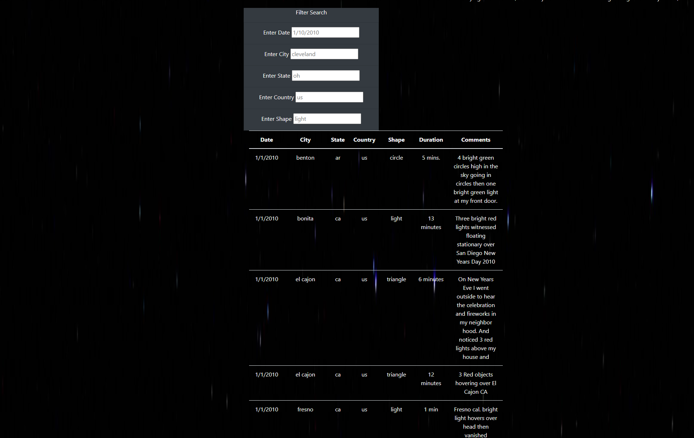
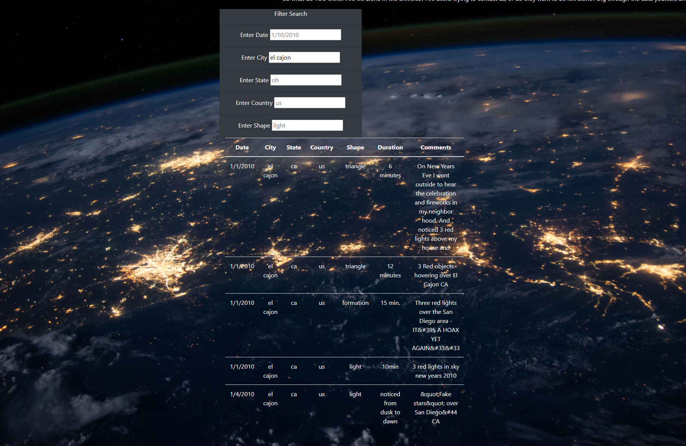

# UFOs

## Overview of the Analysis

The purpose of this analysis is to dive into JavaScript and how it applies to data analytics and visualization. In this project I am assiting a data journalist, Dana, in using a Javasript datafile to create a webpage regarding UFO sightings in her hometown. I am inserting JavaScript into an HTML page, and using CSS, Bootstrap, and ChromeDev to to create this dynamic page. This page consists of a table that shows UFO data, which can be filtered by the date it was sighted, which city, state, and country the UFO sighting took place in, and the shape of the UFO. 

## Results 

To use this webpage, a user needs to enter values into the search filter boxes at the top. Sample words are already nested into the "Filter Search" boxes so that users have an idea of the formatting of their filter searches. The user can input values into any number of the filter boxes that they see fit - although using even just one will help narrow down the search. After entering a value into the box(es), the user will hit enter. The results will display according to the filters that were entered. Please see the images below for examples of how this webpage's filter search process works. 

This image below shows what the webpage looks like prior to filtering. You can see the sample word examples, and how the results follow no pattern yet.

The image below shows what the webpage looks like after filtering for the city of El Cajon. Only data regarding UFO sightings in El Cajon are displayed. 

## Summary

A drawback to this webpage is that it does include a limited dataset and does not have the build in ability for users to add new data. 

Although this webpage is a great starting ground for someone looking for UFO sightings in certain cities, it could be an even better page with a few additional tweaks. For one, we can pull from a wider range of data than just the limited amount the JavaScript file that we currently have. This way, a wider range of cities can be reached. We could also allow for users to add their own sightings onto the page, if those sightings can be supported and then approved. 

